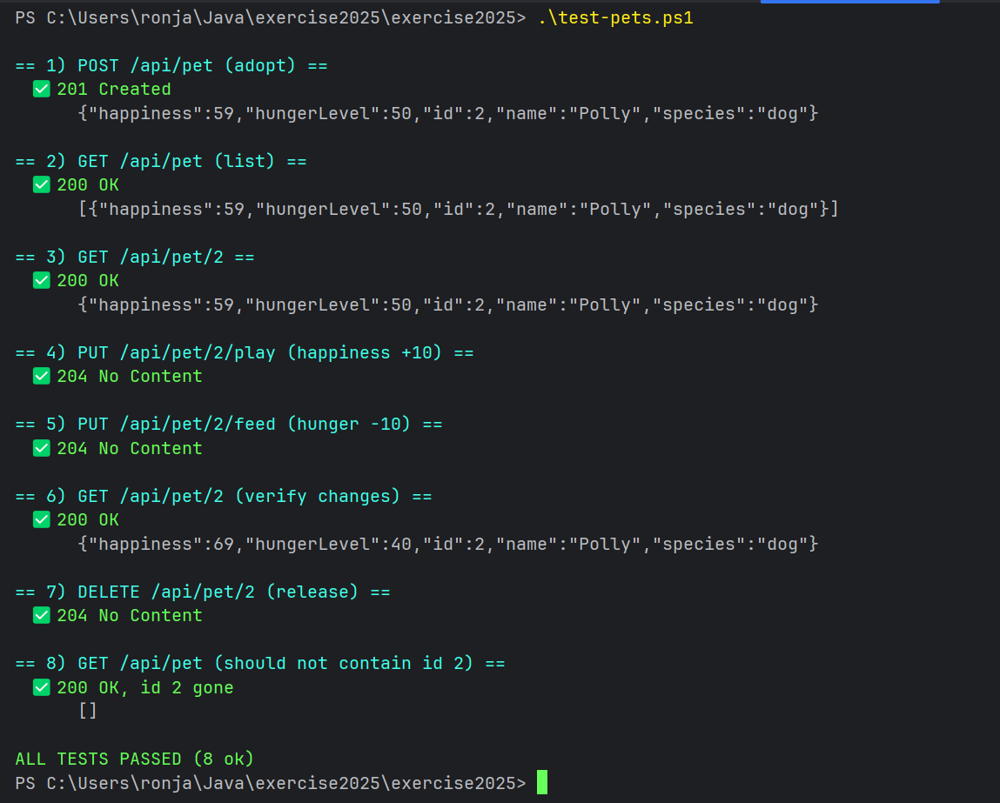

http://localhost:8080/jakartaee-hello-world/api/hello

http://localhost:8080/ => Static HTML
http://localhost:8080/api/hello => Endpoint OK

Goal: A simple server that can receive REST API requests to handle virtual animals without a database.
-> Adopt
-> Feed
-> Play with
-> Release

### Commands:
* server start: _mvn clean package wildfly:run_
* delete previous build files in target/: _mvn clean_
* start wildfly server locally and load the .war-app: _wildfly:run_
* shutdown server: _mvn wildfly:shutdown_
* clean and restart:
taskkill /F /IM java.exe
mvn clean package wildfly:run

## TODO:
[x] REST- server & Jakarta EE (java´s standard for building webb apps and REST api´s)
Served through wildfly which is an application server that runs my API.

[x] Entry point file
ApiApplication.java with code:[@ApplicationPath("/api") public class ApiApplication extends Application { } ]

[x] Create pet data that is ready to be used.
JSON format:
{
"name": "Polly",
"species": "Dog",
"hungerLevel": 59,
"happiness": 90
}

[x] Create a pet service file, with all the logic for pet handling
[x] Create and test REST resource
Try following test sequence in powershell:
# 1) adopt
curl -Method POST http://localhost:8080/api/pet `
  -ContentType "application/json" `
-Body '{"name":"Polly","species":"dog","hungerLevel":50,"happiness":90}'
# 2) play
curl -Method PUT http://localhost:8080/api/pet/1/play
# 3) feed
curl -Method PUT http://localhost:8080/api/pet/1/feed
# 4) check
curl http://localhost:8080/api/pet/1
# 5) release
curl -Method DELETE http://localhost:8080/api/pet/1

OK, so I discovered powershell test scripts 🤤 

______________________________________________________
## Assignment 6 - https://github.com/fungover/exercise2025/issues/142

About the assignment:
🎯 Objective
[x] Start your implementation from the branch kappsegla/jakarta-ee which is setup for jakarta ee with java 21.

Implement a RESTful Web Service using Jakarta EE 10 and the JAX-RS specification. The service will run inside an
application server (e.g., WildFly) and utilize CDI for dependency injection and Bean Validation for input validation. No
persistence layer will be used; instead, data will be stored in a thread-safe in-memory service.

📦 Technologies
Jakarta EE 10
JAX-RS (REST API)
CDI (Dependency Injection)
Bean Validation
DTOs for JSON serialization/deserialization
Concurrency-safe collections or locking

🧱 Functional Requirements
Define a Pet DTO class with Bean Validation for the fields with name, species, hungerLevel and happiness.

Create a thread-safe service class to manage Pets:
Use ConcurrentHashMap<Long, PetDTO> or CopyOnWriteArrayList
Optionally use ReentrantLock for atomic updates (e.g., feeding or playing)

🐼Implement a JAX-RS resource class:
POST /pets → Adopt a new pet
GET /pets → List all pets
GET /pets/{id} → View pet status
PUT /pets/{id}/feed → Feed the pet (reduce hunger)
PUT /pets/{id}/play → Play with the pet (increase happiness)
DELETE /pets/{id} → Release the pet

👌Validation:
Use @Valid on incoming DTOs
Return 400 Bad Request for invalid input
Include meaningful error messages in JSON
Custom Exception Mappers, Implement @Provider classes to handle exceptions like ValidationException, NotFoundException

🌶️Bonus Features for higher grades:
Pagination GET /pets?offset=0&limit=10
Filtering GET /pets?species=cat
Sorting GET /pets?sortBy=happiness&order=desc
